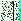
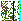

**Elementos de Programação** 

*Relatório da Primeira Parte do Projeto* 

*Departamento de Matemática, IST 2018/2019*

Os ficheiros enviados juntamente com este relatório que contém os módulos são os seguintes:

- evento\_c.py - módulo que disponibiliza o tipo de dados *evento*
- cap\_c.py  -  módulo  que  disponibiliza  o  tipo  de  dados  *cadeia  de  acontecimentos pendentes*
- individuo\_c.py - módulo que disponibiliza o tipo de dados *individuo*
- grelha\_c.py - módulo que disponibiliza o tipo de dados *grelha*

**evento\_c.py**  

Este  módulo  disponibiliza  o  tipo  de  dados  *evento*.  O  tipo  de  dados  foi  implementado através da definição da classe *evento* que disponibiliza os seguintes métodos: 

- **tempo ():** devolve o instante do evento 
- **tipo ():** devolve o tipo de evento 
- **ID ():** devolve o identificador do evento 

A criação destes objetos é feita fornecendo três parâmetros: o tempo do evento, o tipo de evento  (reprodução,  deslocamento,  avaliação  ou  morte)  e  o  identificador  do  objeto (nomeadamente, o identificador do indivíduo ao qual este evento está associado). De seguida, apresentamos alguns exemplos da utilização desta classe: 

`In [1]: import evento\_c as event`

`In [1]: a = event.evento(1,'Tipo 1',20) In [2]: b = event.evento(2,'Tipo 2',55) In [3]: e = event.evento(3,'Tipo 1',83) In [4]: a.tempo()` 

`Out [4]: 20` 

`In [5]: b.tipo()` 

`Out [5]: 'Tipo 2'` 

`In [6]: e.ID ()` 

`Out [6]: 3` 

**cap\_c.py** 

Este módulo disponibiliza o tipo de dados *cadeia de acontecimentos pendentes*. O tipo de dados  foi  implementado  através  da  definição  da  classe  *cap*  que  disponibiliza  os  seguintes métodos: 

- **adicionarE (e):** adiciona o evento *e* à cap 
- **proxE ():** devolve o evento com menor tempo da cap, caso esta não esteja vazia 
- **retirarE ():** elimina o evento com menor tempo da cap, caso esta não esteja vazia 
- **eliminarID ()**: remove todos os eventos associados a um certo identificador 
- **tamC ():** devolve o tamanho da cap 
- **mostraC ():** mostra o conteúdo da cap 

Internamente a CAP funciona como uma lista à qual se adicionam itens da classe *evento*. Os eventos são ordenados por ordem crescente de tempo. Desta forma, o próximo evento é sempre  o  primeiro  da  lista.  Para  manter  a  ordem  quando  se  adiciona  um  evento  à  CAP, primeiro procura-se o elemento imediatamente anterior ao que se quer introduzir e introduz- se o evento a seguir a este. De forma a aumentar a eficiência, para encontrar este evento usa- se um algoritmo de busca parecido com o exercício feito na aula para a procura de zeros de uma  função  usando  o  Teorema  de  Bolzano-Weierstrass.  Este  módulo  importa  o  módulo evento\_c.py.  Cada  objeto  é  criado  inicialmente  sem  eventos  (cap  vazia).  De  seguida, apresentamos alguns exemplos da utilização desta classe: 

`In [1]: import cap\_c as cap` 

`In [2]: c = cap.CAP ()` 

`In [3]: c.adicionarE(a)` 

`In [4]: c.adicionarE(b)` 

`In [5]: c.adicionarE(e)` 

`In [6]: c.proxE()` 

`Out [6]: <evento\_c.evento at 0x10e9e4ef0> In [7]: c.proxE().time()` 

`Out [7]: 20` 

`In [7]: c.mostraC()` 

`ID: 2    Tipo: tipo2    Tempo: 20` 

`ID: 3    Tipo: tipo3    Tempo: 50` 

`ID: 1    Tipo: tipo1    Tempo: 56` 

`In [8]: c.retirarE()` 

`In [9]: c.proxE().time()` 

`Out [9]: 50` 

`In [10]: c.eliminarID(1)` 

`In [11]: c.mostraC()` 

`ID: 3    Tipo: tipo3    Tempo: 50` 

`In [12]: d.tamC() Out [12]: 1` 

**individuo\_c.py** 

Este módulo disponibiliza o tipo de dados *individuo*. O tipo de dados foi implementado através da definição da classe *individuo* que disponibiliza os seguintes métodos: 

- **estado ():** devolve o estado do indivíduo (pode ser S, E, I, R) 
- **ID ():** devolve o identificador do indivíduo 
- **mudae (e)**: permite alterar o estado de um indivíduo 

A  criação  destes  objetos  é  feita  fornecendo  dois  parâmetros:  o  estado  do  indivíduo (suscetível,  exposto,  infetado  ou  recuperado)  e  o  identificador  do  indivíduo.  De  seguida, apresentamos alguns exemplos da utilização desta classe:** 

`In [1]: import individuo\_c as individuo In [2]: a = individuo.individuo(1,'S') In [3]: b = individuo.individuo(2,'E') In [4]: a.ID ()` 

`Out [4]: 1` 

`In [5]: a.estado()` 

`Out [5]: 'S'` 

`In [6]: b.estado()` 

`Out [6]: 'E'` 

`In [7]: a.mudae('I')` 

`In [8]: a.estado()` 

`Out [8]: 'I'` 

**grelha\_c.py**  

Este  módulo  disponibiliza  o  tipo  de  dados  *grelha*.  O  tipo  de  dados  foi  implementado através da definição da classe *grelha* que disponibiliza os seguintes métodos: 

- **encontrar (ID)**: devolve a posição de um indivíduo com um dado identificador 
- **obj (p)**: devolve o objeto na posição p (seja este um indivíduo, obstáculo ou livre) 
- **insI (ind,p)**: adiciona um indivíduo (ind) a uma dada posição (p) 
- **delI (p)**: retira um indivíduo de uma dada posição 
- **usaQ (p)**: devolve True se uma posição não tem obstáculos 
- **livQ (p)**: devolve True se uma posição está livre (=None), e False caso contrário 
- **ocuQ (p)**: devolve True se a posição p se encontra ocupada por um indivíduo, e False caso contrário 
- **infQ  (p)**:  devolve  True  se  uma  posição  tiver  um  indivíduo  infetado,  e  False  caso contrário 
- **susQ  (p):**  devolve  True  se  uma  posição  tiver  um  indivíduo  suscetível,  e  False  caso contrário 
- **expQ  (p):**  devolve  True  se  uma  posição  tiver  um  indivíduo  exposto,  e  False  caso contrário 
- **recQ (p):** devolve True se uma posição tiver um indivíduo recuperado, e False caso contrário 
- **lis\_Q (c,w)**: devolve a lista dos elementos de w que verificam o predicado c 
- **dentrogrelha(p)**:  assegura  que  uma  coordenada  está  contida  na  grelha.  Caso  não esteja, coloca-a na grelha 
- **viz1 (ID)**: devolve as posições da vizinhança 1 de um indivíduo 
- **viz2 (ID)**: devolve as posições da vizinhança 2 de um indivíduo 
- **contactoQ (aID,bp)**: recebendo o ID de um indivíduo a e a posição de um indivíduo b, devolve True se estes estiverem em contacto, e False caso contrário 
- **nInf ()**: devolve o número total de indivíduos infetados na grelha 
- **c\_estados ()**: devolve uma lista de listas com as coordenadas de cada indivíduo em cada estado 

Este  módulo  importa  o  módulo  individuo\_c.py.  A  criação  destes  objetos  é  feita fornecendo dois parâmetros: a dimensão N da grelha e a lista de obstáculos. Internamente a grelha funciona como uma matriz: na criação de uma grelha ocupam-se todas as posições com “O” se for um obstáculo ou *None* caso contrário. De seguida, apresentamos alguns exemplos da utilização desta classe: 

`In [1]: import individuo\_c as ind In [2]: import grelha\_c as gr` 

- `Criar a grelha In[3]:g=gr.Grelha(3,[(2,3),(2,2),(2,1),(2,0),(2,-1),(2,-2),(2,-3)])` 
- `Cria indivíduos para pôr na grelha In [4]: a = ind.individuo(1,'S')` 

`In [5]: b = ind.individuo(2,'S')` 

`In [6]:c = ind.individuo(3,'S')` 

`In [7]: d = ind.individuo(4,'S')` 

`In [8]: e = ind.individuo(5,'S')` 

`In [9]: f = ind.individuo(6,'I')` 

`In [10]: h = ind.individuo(7,'I') In [11]: i = ind.individuo(8,'I') In [12]: j = ind.individuo(9,'I') In [13]: k = ind.individuo(10,'I')` 

- `Adiciona os indivíduos à grelha In [14]: g.insI(a,[1,2])` 

`In [15]: g.insI(b,[1,-2])` 

`In [16]: g.insI(c,[-1,-2])` 

`In [17]: g.insI(d,[-1,-3])` 

`In [18]: g.insI(e,[-1,3])` 

`In [19]: g.insI(f,[1,3])` 

`In [20]: g.insI(h,[1,1])` 

`In [21]: g.insI(i,[1,-1]) In [22]: g.insI(j,[-1,-1]) In [23]: g.insI(k,[-1,0])` 

`In [24]: g.obj ([1,1])` 

`Out [24]: <individuo\_c.individuo at 0x18153ea5c0> In [25]: g.delI([1,1])` 

`In [26]: g.obj([1,1])  # Como a posição está vazia, não devolve nada In [27]: g.obj([2,1])` 

`Out [27]: 'O'` 

`In [28]: g.encontrar(3)` 

`Out [28]: [-1, -2]` 

`In [29]: g.encontrar(6) Out [29]: [1, 3]` 

`In [30]: g.usaQ([-3,3])       # para posição vazia (=None) Out [30]: True` 

`In [31]: g.usaQ([1,2])        # posição com indivíduo  Out [31]: True` 

`In [32]: g.usaQ([2,2])        # posição com obstáculo` 

`Out [32]: False` 

`In [33]: g.livQ([-3,3])     # para posição vazia Out [33]: True` 

`In [34]: g.livQ([1,2])      # posição com indivíduo Out [34]: False` 

`In [35]: g.livQ([2,2])      # posição com obstáculo Out [35]: False` 

`In [36]: g.ocuQ([-3,3])       # para posição vazia Out [36]: False` 

`In [37]: g.ocuQ([1,2])        # posição com indivíduo Out [37]: True` 

`In [38]: g.ocuQ([2,2])        # posição com obstáculo Out [38]: False` 

`In [39]: g.susQ([1,-2]) Out [39]: True` 

`In [40]: g.susQ([1,-1]) Out [40]: False` 

`In [41]: g.infQ([1,-2]) Out [41]: False` 

`In [42]: g.infQ([1,-1]) Out [42]: True` 

`In [43]: g.expQ([1,-1]) Out [43]: False` 

`In [44]: g.recQ([1,-1]) Out [44]: False` 

`In [45]: g.dentrogrelha([4,0]) Out [45]: [-3, 0]` 

`In [46]: g.dentrogrelha([2,0]) Out [46]: [2, 0]` 

`In [47]: g.viz1(a.ID())` 

`Out [47]: [[0, 1], [0, 2], [0, 3], [1, 1], [1, 3], [2, 1], [2, 2], [2, 3]]` 

`In [48]: g.viz1(f.ID())` 

`Out [48]: [[0, 2], [0, 3], [0, -3], [1, 2], [1, -3], [2, 2], [2, 3], [2, -3]]` 

`In [49]: g.viz2(a.ID())` 

`Out [49]:` 

`[[-1, 0],` 

` ``[-1, 1],` 

` ``[-1, 2],` 

` ``[-1, 3],` 

` ``[-1, -3],` 

` ``[0, 0],` 

` ``[0, -3],` 

` ``[1, 0],` 

` ``[1, -3],` 

` ``[2, 0],` 

` ``[2, -3],` 

` ``[3, 0],` 

` ``[3, 1],` 

` ``[3, 2],` 

` ``[3, 3],` 

` ``[3, -3]]` 

`In [50]: g.viz2(f.ID())` 

`Out [50]:` 

`[[-1, 1],` 

` ``[-1, 2],` 

` ``[-1, 3],` 

` ``[-1, -3],` 

` ``[-1, -2],` 

` ``[0, 1],` 

` ``[0, -2],` 

` ``[1, 1],` 

` ``[1, -2],` 

` ``[2, 1],` 

` ``[2, -2],` 

` ``[3, 1],` 

` ``[3, 2],` 

` ``[3, 3],` 

` ``[3, -3],` 

` ``[3, -2]]` 

`In [51]: g.lis\_Q(g.livQ,g.viz1(a.ID())) Out [51]: [[0, 1], [0, 2], [0, 3], [1, 1]]` 

`In [52]: g.lis\_Q(g.livQ,g.viz1(f.ID()))` 

`Out [52]: [[0, 2], [0, 3], [0, -3], [1, -3]]` 

`In [53]: g.contactoQ(a.ID(),g.encontrar(b.ID())) Out [53]: False` 

`In [54]: g.contactoQ(a.ID(),g.encontrar(d.ID())) Out [54]: True` 

`In [55]: g.nInf() Out [55]: 4` 

`In [56]: g.c\_estados()` 

`Out [56]:` 

`[[(-1, 3), (1, 2), (-1, -2), (1, -2), (-1, -3)],  [],` 

` ``[(1, 3), (-1, 0), (-1, -1), (1, -1)],` 

` ``[]]` 

**Elementos de Programação** 

*Relatório da Segunda Parte do Projeto* 

*Departamento de Matemática, IST 2018/2019*

Para  o  simulador  decidimos  usar  os  módulos  que  nós  definimos, nomeadamente *event\_c, cap\_c, individuo\_c* e *grelha\_c.* Os módulos utilizados foram os enviados anteriormente exceto a função eliminaID(ID) da *cap.* A função foi utilizada foi a seguinte: 

`    def eliminarID(self,ID): `

`        i=len(self.CAP)-1 `

`        while i>=0: `

`            if self.CAP[i].ID()==ID: `

`                self.CAP.remove(self.CAP[i])             i=i-1 `

- Enviamos em anexo os módulos já corrigidos. 
- Definimos  uma  variável  global  novoID,  que  nos  permitiu  ir  criando  novos  e  diferentes identificadores para cada indivíduo. 

**Funções** 

Definimos as seguintes funções: 

- texp(x) 
- novoI(e,p,t)
- popular(w,Ps,Pi,cen,padj) 
- Pe(x) 

**texp(m)** 

Dado um tempo m, calcula um tempo aleatório usando distribuição exponencial. **novoID(e,p,t)** 

Dado um estado, uma posição e o tempo atual da simulação, cria um indivíduo com uma nova identificação e o estado “e”,  adiciona o mesmo na posição “p” e adiciona à CAP um evento  da  deslocação,  reprodução,  morte  e  (dependendo  do  estado)  avaliação  (eventos “essenciais”) no tempo atual “t” mais o tempo médio de evento aleatório usando distribuição exponencial. 

**popular(w,Ps, Pi,cen,padj)** 

Esta  função  popula  a  grelha,  isto  é,  acrescenta  indivíduos  à  grelha,  dependendo  do cenário. Esta distribuição pode ser aleatória (cenário ‘a’) ou agrupar uma percentagem, dada pelo  utilizador,  de  indivíduos  em  posições  adjacentes  (cenário  ‘b’).  O  cenário  é  escolhido através  do  parâmetro  *cen*  da  função  *sim.*  **e  a  percentagem  de  individuos  em  posições adjacentes pelo parâmetro padj** 

Se  o  cenário escolhido for o cenário ‘a’, os indivíduos são colocados aleatoriamente na 

grelha. 

Caso o cenário escolhido seja o cenário ‘b’, o primeiro indivíduo é colocado aleatoriamente na  grelha,  e  os  indivíduos  seguintes  (até  a  percentagem  ser  atingida)  são  adicionados adjacentes  ao  anterior.  Quando  este  processo  está  concluído,  os  restantes  indivíduos  são adicionados aleatoriamente na grelha (tal como no cenário ‘a’) 

**Pe(x)** 

Dado  o  ID  de  um  individuo,  calcula  a  probabilidade  deste  passar  de  suscetivel  a exposto. Calcula n1 calculando o tamanho da lista dos individuos infetados da vizinhança 1 do individuo com ID = x e n2 calculando o número de individuos infetados na vizinhança 2 que se encontram  em  contacto  com  o  individuo  com  ID  =  x.  Serão  estes  valores  depois  a  serem aplicados à expressão dada.

**While do simulador** 

Para  começar,  definimos  uma  grelha,  uma  *cap*,  populamos  a  grelha  e  define-se  o 

tempo(=0). 

O simulador tem como condição de paragem o tempo limite da simulação e a *cap* (a simulação acaba quando a *cap* estiver vazia). 

Para cada evento, o simulador verifica o tipo de evento que vai ocorrer (deslocamento, reprodução,  morte  ou  avaliação)  e  dependendo  da  probabilidade  de  cada  evento,  este  é realizado ou não. Caso seja realizado, ocorre como explicado acima para cada evento. 

Ao longo do *while*, é adicionado a uma lista valores que x e y que irão formar o gráfico. O valor de x corresponde ao tempo decorrido, e começa em 0 e vai até Th. O y é o número de infetados  na  simulação ao longo do tempo. Este valor aumenta cada vez que um indivíduo exposto  passa  a  infetado  e  diminui  de  cada  vez  que  um  indivíduo  infetado  morre  ou  um indivíduo infetado volta a recuperado. 

No  final  do  ciclo é definida uma variável “prox” contendo o próximo evento, assim como o tempo do mesmo (para ser avaliado na condição de paragem) e o ID 

**Tipos de Eventos** 

**Deslocamento** 

Se o comprimento da lista das posições livres da vizinhança 1 do individuo com ID

- x for superior a 0 (quando existe posições adjacentes livres), se o comprimento da lista das posições dos indivíduos infetados da vizinhança 1 do individuo com ID = x for superior a 2, este  move-se  sempre,  inserindo  na  grelha  o  indivíduo  numa  dessas  posições  livres  e apagando-o da posição inicial, caso o comprimento da lista das posições dos infetados da vizinhança 1 do individuo com ID = x for inferior a 3, este desloca-se (inserindo na grelha o indivíduo numa dessas posições livres e apagando-o da posição inicial) com probabilidade pd. Quando o evento acaba de ocorrer (havendo ou não deslocação), é criado o próximo evento de deslocação para o indivíduo com ID = x com o tempo de evento igual ao tempo atual mais o tempo médio de deslocação aleatório usando distribuição exponencial e adicionado à CAP.

**Reprodução** 

Se o comprimento da lista das posições livres da vizinhança 1 do individuo com ID

- x for superior a 0 (quando existe posições adjacentes livres) e se o comprimento da lista das posições ocupadas por indivíduos da vizinhança 1 do individuo com ID = x for superior a 0, este reproduz-se, utilizando a função *novoID* para criar, adicionar à grelha, criar os eventos “essenciais” e adicioná-os à CAP numa posição aleatória adjacente ao indivíduo com ID = x com probabilidade pr. 

Quando o evento acaba de ocorrer (havendo ou não reprodução), é criado o próximo evento de reprodução para o indivíduo com ID = x com o tempo de evento igual ao tempo atual  mais  o  tempo  médio  de  reprodução  aleatório  usando  distribuição  exponencial  e adicionado à CAP.

**Morte** 

Se o estado do indivíduo com ID = x for “infectado”, este é apagado da grelha e todos os  seus  eventos  na  CAP  são  também  eliminados  com  probabilidade  pm  mais  10%  de  pm (pm\*1.1) com o máximo de pm = 1. Se no entanto o estado do indivíduo com ID = x não for “infetado”,  este  apenas  é  apagado  da grelha e todos os seus eventos na CAP são também eliminados com probabilidade pm.

Quando  o  evento  acaba  de  ocorrer  e  somente  se  não  houver  morte,  é  criado  o próximo evento de morte para o indivíduo com ID = x com o tempo de evento igual ao tempo atual mais o tempo médio de morte aleatório usando distribuição exponencial e adicionado à CAP.

**Avaliação** 

Se o estado do indivíduo com ID = x for “infectado”, este muda o seu estado para “recuperado” 

Se o estado do indivíduo com ID = x for “exposto”, este muda o seu estado para “infetado” e é criado o próximo evento de avaliação para o indivíduo com ID = x com o tempo 

de  evento  igual  ao  tempo  atual  mais  o  tempo  médio  de  avaliação  “I”  aleatório  usando distribuição exponencial e adicionado à CAP. 

Se o estado do indivíduo com ID = x não for nem “infectado” nem “exposto” (logo, individuo com estado “suscetível”, visto que um indivíduo com estado “recuperado” não está sujeito a avaliação) e o comprimento da lista das posições dos individuos infetados da vizinhança 1 e 2 do  individuo  com  ID  =  x for superior a 0, este muda o seu estado para “exposto” e é criado o próximo evento de avaliação para o indivíduo com ID = x com o tempo de  evento  igual  ao  tempo  atual  mais  o  tempo  médio  de  avaliação  “E”  aleatório  usando distribuição exponencial e adicionado à CAP com probabilidade Pe(x). Caso o comprimento da lista das posições dos individuos infetados da vizinhança 1 e 2 do individuo com ID = x for igual a 0 ou não atinge a probabilidade necessária, o seu estado mantém-se “susceptivel” e é criado o próximo evento de avaliação para o indivíduo com ID = x com o tempo de evento igual  ao  tempo  atual  mais  o  tempo  médio  de  avaliação  “S”  aleatório usando distribuição exponencial e adicionado à CAP. 

**Criação do ficheiro resultados.txt** 

É aberto um ficheiro (resultados.txt) onde irá ser adicionada a lista com 4 listas com as coordenadas  dos  indivíduos  susceptíveis,  expostos,  infectados  e  recuperados, respectivamente, 

correspondendo a evolução da grelha ao longo do tempo. 

É escrito na primeira linha a dimensão N da grelha e na segunda a lista de obstáculos. 

No  inicio  de  cada  ciclo  do  simulador  é  definida  uma  variável  “c”  boleana  com  o  valor de “False”,  e  no  final  de  cada  evento,  se  este  ocorre  (havendo então alteração do aspeto da grelha) esta passa a “True”. Aquando do final do ciclo, se houver de facto alguma alteração, é então escrito no ficheiro uma linha com a lista das 4 listas das posições dos estados. Caso não haja alteração (o evento não se realiza), não escreve, diminuindo assim substancialmente o tamanho do ficheiro. 

No final da simulação fecha-se o ficheiro. 

**Criação do gráfico com a evolução do número de infectados ao longo do tempo** 

É criada inicialmente aquando da introdução dos individuos iniciais na grelha duas listas (“grafx” e “grafy”), sendo que a primeira representa o tempo e a segunda o número de individuos “infectados” na grelha.  

É também definida uma variavel “nInf” que atualiza o número de individuos “infectados” na grelha. Esta começa por ser igual a Pi, e como só existe diminuição do número de individuos infetados (nInf=nInf-1) aquando da morte ou da avaliação (Inf -> Rec) de de um indivíduo infetado e aumento do número de individuos infetados (nInf=nInf+1) aquando da avaliação de (Exp -> Inf) de um indivíduo exposto, só se registam (adicionando a “grafx” o tempo atual e a “grafy” o número atualizado de individuos infetados na grelha) nestas situações. 

No final da simulação, cria-se o gráfico com os valores de x cada entrada de “grafx” e os valores de y cada entrada de “grafy”, define-se a dimensão dos eixos e adiciona-se legenda ao gráfico. 

**Resultados** 

- **Nota:**  conseguimos  exportar  o  ficheiro  mp4,  contudo  a  qualidade  é  bastante reduzida, pelo que anexámos uma pasta para cada cenário que contém a animação da simulação cujos gráficos são apresentados abaixo. 
- Os  cenários  apresentados  abaixo  foram  obtidos  usando  o  simulador  com  os parâmetros sugeridos no enunciado. 

**Cenário ‘a’ (ver animação1)** 

**Cenário ‘b’ (ver animação2) (simulação com percentagem 70%)** 

 

